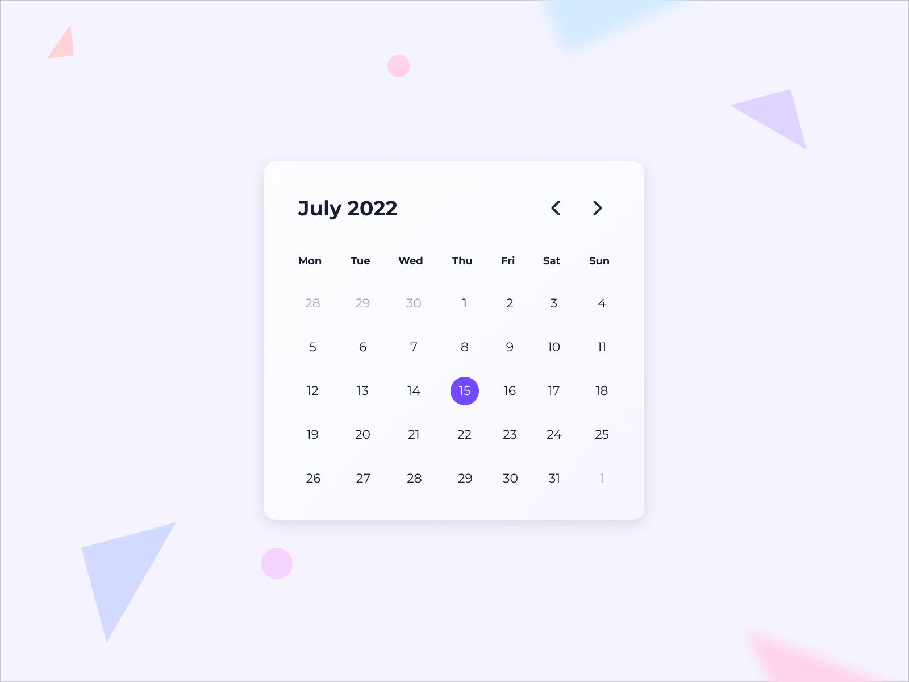

**Challenge Title**
Calendar Viewer

**Live Preview** [Click Here](https://sahilatahar.github.io/Front-End-Challenges/calendar-viewer)

**Challenge Description**
In this challenge, you'll build a Calendar Viewer Component. This challenge is perfect for you if you've been learning JavaScript and want to take your JavaScript skills to the next level by building a real-world project.

**Difficulty Level**
Intermediate

**Tags**
FRONTEND

**Learning**
In this challenge, You'll also practice how to use DOM manipulation to manipulate the data. This is a great skill to have in your developer’s belt because it can help you create more dynamic and interactive websites. So what are you waiting for?

**Requirements**

- See a highlighted today’s date.
- Change the month of the year.
- See the selected date in a different background color.

**Taking your Project to the Next Level**

- Use a framework like React, Vue, or Svelte. Or, if you're feeling particularly adventurous, try writing everything in Vanilla JavaScript.

I hope you'll enjoy building this challenge.

Feel free to share your solution on the website or on social media and tag [us](https://twitter.com/codingspace30).
