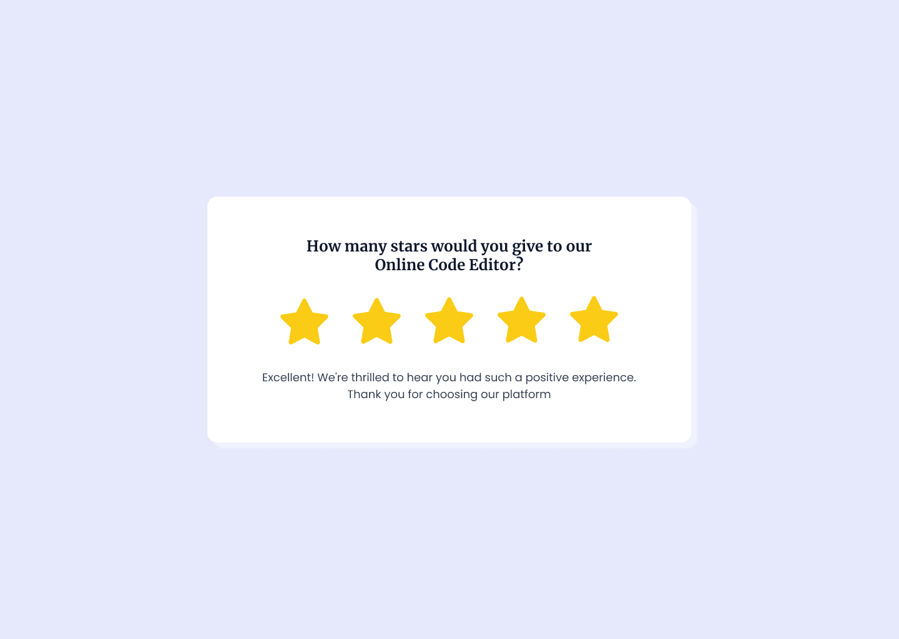

**Challenge Title**
Star Rating Component

**Challenge Description**
In this frontend challenge, you'll build a Star Rating Component. This challenge is perfect for you if you're interested in building front-end web components and taking your front-end skills to the next level!

**Difficulty Level**
Intermediate

**Tags**
FRONTEND

**Learning**
In this frontend challenge, you'll learn how to build a real-world UI component using JavaScript or ReactJs. You'll also learn how to use CSS Flexbox to lay out the component and make it responsive. This frontend challenge is a great opportunity to improve your JavaScript & ReactJs skills by building a frontend web component. You're going to love it!

**Requirements**

- The Star Rating component should display a set of stars that can be clicked or hovered over to select a rating.
- The component should be customizable, with an option to change the number of stars to be displayed.
- When the user clicks on a star to select a rating, the rating should be updated, and a corresponding message should be displayed.
- The component should ensure that hovering over the third star after selecting the fourth star highlights only the first, second and third stars.

**Bonus Requirements**

- The component should allow users to select half-ratings (e.g., 4.5 stars).

**Text**

1. 5-star rating: Excellent! We're thrilled to hear you had such a positive experience. Thank you for choosing our product/service.
2. 4-star rating: Thank you for your positive feedback! We're glad to know that you had a great experience and we appreciate your support.
3. 3-star rating: Thank you for your feedback. We're sorry to hear that your experience wasn't perfect. We would love to hear more about your concerns to see how we can improve.
4. 2-star rating: We apologize for the inconvenience you experienced. We appreciate your feedback and would like to work with you to address any issues.
5. 1-star rating: We're sorry to hear that you had a bad experience. We would like to learn more about what happened and how we can make things right.

I hope you'll enjoy building this challenge.

Feel free to share your solution on the website or on social media and [tag us](https://twitter.com/FrontendProHQ).
