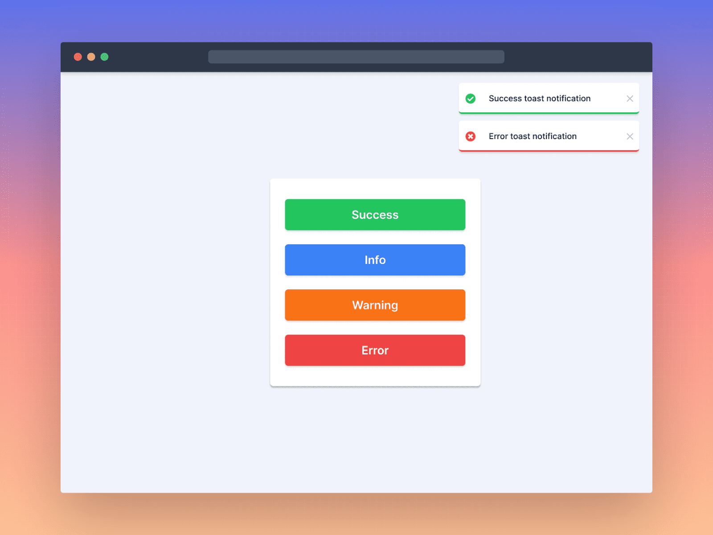

# Toast Notification

## [Live Preview](https://toast-notification-frontendpro.netlify.app/)

**Challenge Description**
In this challenge, you'll build a Toast Notification Component. This challenge is perfect for you if you're interested in building complex and reusable front-end web components and taking your front-end skills to the next level!

**Difficulty Level**
Intermediate

**Tags**
FRONTEND

**Learning**
In this frontend challenge, You'll learn how to build a Toast Notification Component from scratch that displays different types of notifications. You'll also learn how to add smooth animations to the notifications. If you're using ReactJs, you'll also have the chance to learn how to implement the Context API. This challenge provides a great chance to enhance your JavaScript or ReactJs skills by working on a real-world front-end project. You're going to love it!

**Requirements**

- The Toast Notification component should support displaying different types of notifications, such as success, warning, error, and information messages.
- The component should display notifications in the top-left corner of the page by default.
- Notification should automatically disappear after 5 seconds.
- The Toast Notification should include a dismiss button that allows the user to close the notification.
- The component should be able to handle multiple notifications at once and display them in a stack, with the latest notification being displayed on top.
- Notifications should appear and disappear smoothly, with a subtle animation.
- If using JavaScript frameworks or libraries like ReactJs, users should be able to show new notifications from any part of the application.
- The component should be responsive and display correctly on different screen sizes.
- Make this landing page look as close to the design as possible.

**Brownie Points**

- The Toast Notification component should provide an option to customize the position of the notifications.
- The component should display the progress bar to display the remaining time.
- The auto-dismiss timer should be paused when the user hovers over the toast notification and resumes when the user moves the cursor away.

I hope you'll enjoy building this challenge.

Feel free to share your solution on the website or on social media and [tag us](https://twitter.com/FrontendProHQ).
